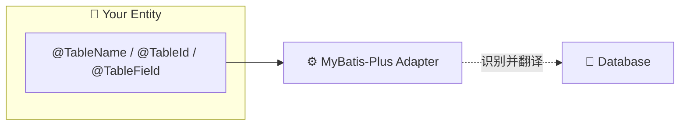

<div style="display: flex; justify-content: center;">
    
</div>

## ⚠️ 重要提示：2.6.2 版本重大变更

> ### 🔴 **立即查看升级指南！**
> 
> AutoTable 2.6.2 版本移除了 MyBatis-Plus 适配器的扩展注解体系。
> 
> #### 🎯 您需要做什么？
> 
> - **如果您从未使用过扩展注解**：无需任何操作，继续使用 MP 原生注解即可正常工作。
> - **如果您使用了扩展注解**（如 `@Column`、`@Table`）**：** **必须迁移到标准注解**，否则将无法工作。
> 
> #### 📖 迁移资源
> 
> - [完整迁移指南](file:///Users/don/Code/个人/auto-table/MIGRATION-FROM-MYBATIS-PLUS-EXT.md) ← **强烈推荐阅读**
> - [常见问题说明](/常见问题/说明#262-升级注意事项)

### ❌ 已移除的扩展注解

| 旧版扩展注解 | ✅ 新版标准注解（使用 MP 原生） | 说明 |
|-------------|-------------------------------|------|
| `@Column` | `@TableField` | MP 原生字段注解 |
| `@ColumnId` | `@TableId` | MP 原生主键注解 |
| `@Table` | `@TableName` | MP 原生表注解 |
| `@UniqueIndex` | `@TableField(exist=false)` | 手动管理索引 |

### ✅ 保留的标准注解

以下注解仍可使用（但建议使用 MP 原生）：
- `@AutoColumn` - 仍可用于多数据库场景
- `@Ignore` - 忽略字段
- 所有 MySQL 专用注解（如 `@MysqlColumnUnsigned`）

## 💡 核心价值：零侵入式集成

AutoTable 适配器让您**无需引入任何 AutoTable 注解**即可享受自动建表能力：

### 🚀 极简演示

#### 第一步：引入依赖

```xml
<!-- 只加这一个 Starter 就够了 -->
<dependency>
    <groupId>org.dromara.autotable</groupId>
    <artifactId>auto-table-adapter-mybatis-plus-spring-boot-starter</artifactId>
    <version>{{version}}</version>
</dependency>
```

#### 第二步：定义实体（完全用 MP 原生注解）

```java
import com.baomidou.mybatisplus.annotation.*;

@Data
@TableName("sys_user")  // ← 只用 MP 的 @TableName
public class User {
    
    @TableId(value = "id", type = IdType.AUTO)  // ← 只用 MP 的 @TableId
    private Long id;
    
    @TableField("username")
    private String username;
    
    @TableField("email")
    private String email;
}
```

#### 第三步：启动应用

```java
import org.mybatis.spring.annotation.MapperScan;
import org.springframework.boot.SpringApplication;
import org.springframework.boot.autoconfigure.SpringBootApplication;

@SpringBootApplication
@MapperScan("com.example.mapper")
public class Application {
    public static void main(String[] args) {
        SpringApplication.run(Application.class, args);
    }
}
```

✨ **完成！** 启动后 AutoTable 会自动：
- 识别所有 `@TableName` 标注的实体
- 根据 `@TableId`、`@TableField` 解析字段
- 自动创建数据库表结构
- 后续修改实体，表结构自动同步

**就这么简单！不需要写一行 AutoTable 的代码！**

## 详细说明

### 工作原理

AutoTable 通过**适配器机制**自动识别和转换 MP 注解：



**核心组件：**
- `MybatisPlusAutoTableClassScanner`：自动扫描实体类上的 `@TableName`
- `MybatisPlusMetadataAdapter`：解析 `@TableId`、`@TableField` 等注解
- `MybatisPlusJavaTypeToDatabaseTypeConverter`：处理类型映射（枚举、Date 等）
- `MybatisPlusRunBeforeCallback`：在 DDL 执行前屏蔽 MP 拦截器插件

### 支持的 MP 注解

AutoTable 会智能识别所有标准 MP 注解：

| MP 注解 | 作用 | AutoTable 支持 |
|--------|------|---------------|
| `@TableName` | 定义表名 | ✅ 自动识别 |
| `@TableId` | 定义主键 | ✅ 支持所有 IdType |
| `@TableField` | 定义字段 | ✅ 支持 exist、value、typeHandler |
| `@EnumValue` | 枚举值标记 | ✅ 自动提取 |
| `@TableName.excludeProperty` | 排除字段 | ✅ 自动识别 |

### 与 MyBatis-Plus-Ext 的关系

如果您使用 [MyBatis-Plus-Ext](https://gitee.com/dromara/mybatis-plus-ext)（扩展版 MP），建议：

```xml
<!-- 同时引入 MPE 和 AutoTable -->
<dependency>
    <groupId>org.dromara.mybatis-plus-ext</groupId>
    <artifactId>mybatis-plus-ext-spring-boot-starter</artifactId>
    <version>X.X.X</version>
</dependency>
<dependency>
    <groupId>org.dromara.autotable</groupId>
    <artifactId>auto-table-adapter-mybatis-plus-spring-boot-starter</artifactId>
    <version>{{version}}</version>
</dependency>
```

这样您可以同时享受：
- MPE 的代码生成、代码预生成等功能
- AutoTable 的自动建表功能
- 两者完美结合，互不干扰

## 配置项

### 自动建库模式

```yaml
auto-table:
  create-database-enabled: true  # 默认 false，自动创建数据库
  database-url: jdbc:mysql://localhost:3306  # 连库 URL
```

### 运行模式

| 模式 | 说明 | 推荐环境 |
|------|------|---------|
| `validate`（默认） | 只校验不修改 | 生产环境 |
| `update` | 自动更新差异 | 开发环境 |
| `create` | 创建缺失表 | 测试环境 |

```yaml
auto-table:
  mode: update
```

### SQL 记录

记录每次执行的 SQL，方便审计和排查问题：

```yaml
auto-table:
  record-sql-enabled: true
  record-sql-type: DB  # 文件 (FILE) 或 数据库 (DB)
```

## 高级特性

### 动态数据源支持

如果使用了 dynamic-datasource，AutoTable 会自动识别：

```yaml
spring:
  datasource:
    dynamic:
      primary: master
      datasource:
        master:
          url: jdbc:mysql://localhost:3306/db_master
        slave:
          url: jdbc:mysql://localhost:3306/db_slave
```

每个数据源的初始化脚本可以放在：
```
classpath:sql/master/_init_.sql
classpath:sql/slave/_init_.sql
```

### Schema 支持

对于 PostgreSQL、Oracle 等多 Schema 数据库：

```java
@TableName(schema = "public", value = "user")
public class User {
    // ...
}
```

AutoTable 会自动创建对应的 Schema 和表。

### 逻辑删除字段

AutoTable 会自动识别 MP 的逻辑删除配置：

```java
@TableField("deleted")
private Integer deleted;
```

配合全局配置：
```yaml
mp:
  global-config:
    db-config:
      logic-delete-field: deleted
      logic-not-delete-value: 0
      logic-delete-value: 1
```

## 常见问题

### 表未创建？

1. 检查是否引入了 starter 依赖
2. 确认实体上有 `@TableName` 注解
3. 查看日志是否有错误信息

### 字段未更新？

1. 确认运行模式为 `update`
2. 检查字段是否被 `@TableField(exist = false)` 标记
3. 确认不是 `static` 或 `final` 字段

### Invalid value type 错误？

通常是类型映射问题：
1. 检查 Java 类型是否能转换为数据库类型
2. 复杂类型可以自定义 TypeHandler

## 相关资源

- [GitHub 仓库](https://github.com/dromara/auto-table)
- [Gitee 仓库](https://gitee.com/tangzc/auto-table)
- [MyBatis-Plus 官方文档](https://baomidou.com/)
- [MyBatis-Plus-Ext](https://gitee.com/dromara/mybatis-plus-ext)
- [更新日志](/更新日志)
- [最佳实践](/最佳实践/生产环境部署)

## 社区支持

如有问题或建议，欢迎：
- 提交 Issue：[Gitee Issues](https://gitee.com/tangzc/auto-table/issues)
- 参与讨论：[贡献指南](/社区/贡献指南)

感谢每一位贡献者！🌟
