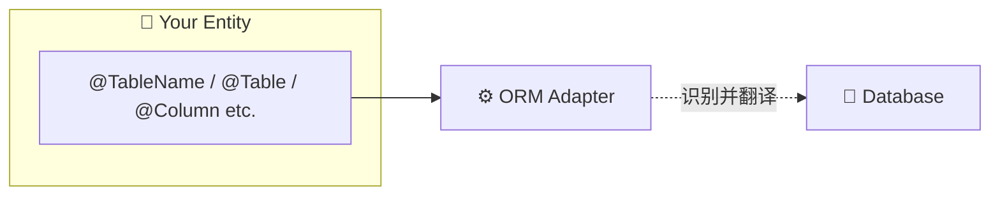

# ORM 框架适配

AutoTable 提供了完善的 ORM 框架适配层，让您**无需引入任何 AutoTable 注解**即可享受自动建表能力。

## 💡 核心价值

### 🎯 零侵入式设计

```java
// ❌ 错误做法 - 使用 AutoTable 自己的注解
import org.dromara.autotable.annotation.AutoTable;
import org.dromara.autotable.annotation.PrimaryKey;

@AutoTable(comment = "用户表")
public class User {
    @PrimaryKey(autoIncrement = true)
    private Long id;
}

// ✅ 正确做法 - 只用 ORM 框架的原生注解
import com.baomidou.mybatisplus.annotation.TableName;
import com.baomidou.mybatisplus.annotation.TableId;

@TableName("user")
public class User {
    @TableId(value = "id", type = IdType.AUTO)
    private Long id;
}
```

**就这么简单！** 只需要引入对应的 Starter 依赖，AutoTable 会自动识别您的 ORM 框架注解并自动创建表！

## 📚 支持的 ORM 框架

| ORM 框架 | 支持状态 | 文档链接 |
|---------|---------|----------|
| **MyBatis-Plus** | ✅ 稳定 | [查看文档](/ORM 适配/Mybatis-Plus) |
| **MyBatis-Flex** | ✅ 稳定 | [查看文档](/ORM 适配/Mybatis-Flex) |
| Solon | ⏳ 计划中 | - |
| JPA/Hibernate | ⏳ 计划中 | - |

## 🔧 工作原理



**核心组件：**
1. **Adapter**: 零 Spring 依赖的核心模块，解析 ORM 注解
2. **MetadataAdapter**: 将 ORM 元数据转换为 AutoTable 标准格式
3. **ClassScanner**: 自动扫描实体类上的 ORM 注解
4. **TypeConverter**: 处理类型映射（枚举、Date 等）
5. **Callback**: 在 DDL 执行前屏蔽 ORM 框架的拦截器插件

## 🚀 快速开始

### 第一步：选择您的 ORM 框架

根据您的技术栈选择合适的适配器：

- **如果您用 MyBatis-Plus**: → [MyBatis-Plus 适配器文档](/ORM 适配/Mybatis-Plus)
- **如果您用 MyBatis-Flex**: → [MyBatis-Flex 适配器文档](/ORM 适配/Mybatis-Flex)

### 第二步：引入依赖

每个适配器都提供 Spring Boot Starter：

```xml
<!-- 以 MyBatis-Plus 为例 -->
<dependency>
    <groupId>org.dromara.autotable</groupId>
    <artifactId>auto-table-adapter-mybatis-plus-spring-boot-starter</artifactId>
    <version>{{version}}</version>
</dependency>
```

### 第三步：启动应用

无需其他配置，启动后自动：
- ✅ 识别所有实体类上的 ORM 注解
- ✅ 解析字段定义和约束
- ✅ 自动创建数据库表
- ✅ 后续修改同步更新

## ⚠️ 重要提示

### 2.6.2 版本变更

AutoTable 2.6.2 版本对 MyBatis-Plus 适配器进行了重大重构：
- ✅ **移除了扩展注解体系**（如 `@Column`、`@Table` 等）
- ✅ **回归原生注解**（使用 MP 的 `@TableField`、`@TableName`）
- ✅ **增强 MyBatis-Flex 支持**（新增适配器）

详细迁移指南：[2.6.2 升级注意事项](/常见问题/说明#262-升级注意事项)

## 🎁 额外特性

除了自动建表，ORM 适配器还提供了：

- **动态数据源支持**: 自动识别多数据源环境
- **Schema 管理**: PostgreSQL、Oracle 等多 Schema 数据库支持
- **逻辑删除兼容**: 自动识别 MP/MF 的逻辑删除标记
- **SQL 记录审计**: 记录每次执行的 DDL 语句
- **防拦截器干扰**: 在执行 DDL 时自动屏蔽租户、非法 SQL 等插件

## 🤝 贡献指南

想为您的 ORM 框架添加 AutoTable 支持？欢迎参与！

- [如何添加新 ORM 适配器](/社区/贡献指南)
- [适配器架构设计](https://gitee.com/tangzc/auto-table/blob/main/auto-table-core/src/main/java/org/dromara/autotable/core/AutoTableMetadataAdapter.java)

感谢您的阅读！如有问题或建议，欢迎提交 Issue。🌟
