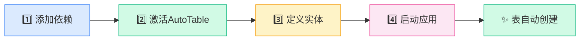
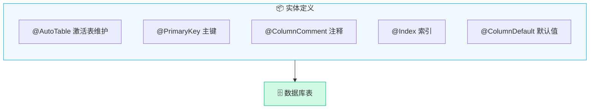
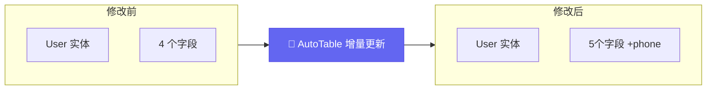
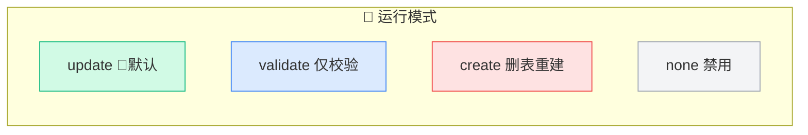
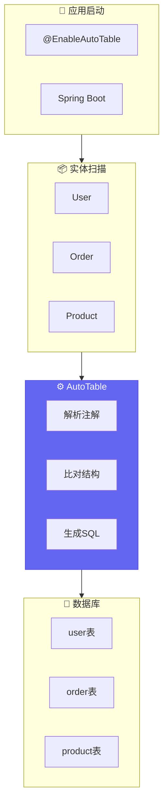

# 5分钟上手

本教程将带你快速体验 AutoTable 的核心功能。

## 快速开始流程



## 前置条件

- 已添加 [AutoTable 依赖](/快速开始/安装)
- 已配置数据库连接

## 第 1 步：激活 AutoTable

::: code-group

```java [Spring Boot]
@EnableAutoTable  // 添加此注解
@SpringBootApplication
public class Application {
    public static void main(String[] args) {
        SpringApplication.run(Application.class, args);
    }
}
```

```java [Solon]
@EnableAutoTable  // 添加此注解
@SolonMain
public class Application {
    public static void main(String[] args) {
        Solon.start(Application.class, args);
    }
}
```

```java [纯 Java]
public class Application {
    public static void main(String[] args) {
        // 1. 设置数据源
        DataSourceManager.setDataSource(dataSource);
        
        // 2. 启动 AutoTable
        AutoTableBootstrap.start();
    }
}
```

:::

## 第 2 步：定义实体



```java
import org.dromara.autotable.annotation.*;
import lombok.Data;

@Data
@AutoTable(comment = "用户表")  // 激活表自动维护
public class User {
    
    @PrimaryKey(autoIncrement = true)
    private Long id;
    
    @ColumnComment("用户名")
    @ColumnNotNull
    @ColumnType(length = 50)
    private String username;
    
    @ColumnComment("邮箱")
    @Index  // 创建索引
    private String email;
    
    @ColumnComment("年龄")
    private Integer age;
    
    @ColumnComment("创建时间")
    @ColumnDefault("CURRENT_TIMESTAMP")
    private LocalDateTime createTime;
}
```

## 第 3 步：启动应用

启动应用，查看控制台日志：

```
    _         _          _____     _     _      
   / \  _   _| |_ ___   |_   _|_ _| |__ | | ___ 
  / _ \| | | | __/ _ \    | |/ _` | '_ \| |/ _ \
 / ___ \ |_| | || (_) |   | | (_| | |_) | |  __/
/_/   \_\__,_|\__\___/    |_|\__,_|_.__/|_|\___|
:: https://autotable.tangzc.com ::      (v2.5.10)

AutoTable执行结束。耗时：156ms
```

查看数据库，`user` 表已自动创建：

```sql
CREATE TABLE `user` (
  `id` bigint NOT NULL AUTO_INCREMENT,
  `username` varchar(50) NOT NULL COMMENT '用户名',
  `email` varchar(255) DEFAULT NULL COMMENT '邮箱',
  `age` int DEFAULT NULL COMMENT '年龄',
  `create_time` datetime DEFAULT CURRENT_TIMESTAMP COMMENT '创建时间',
  PRIMARY KEY (`id`),
  KEY `auto_idx_email` (`email`)
) COMMENT='用户表';
```

## 第 4 步：修改实体



尝试修改实体，添加新字段：

```java
@Data
@AutoTable(comment = "用户表")
public class User {
    // ... 原有字段
    
    @ColumnComment("手机号")  // [!code ++]
    private String phone;     // [!code ++]
}
```

重启应用，AutoTable 自动执行：

```sql
ALTER TABLE `user` ADD COLUMN `phone` varchar(255) COMMENT '手机号';
```

## 运行模式说明



## 配置说明

默认配置即可满足开发环境使用。常用配置项：

```yaml
auto-table:
  # 运行模式：none | validate | create | update（默认）
  mode: update
  # 是否显示 banner
  show-banner: true
  # 自动删除实体中不存在的字段（谨慎开启）
  auto-drop-column: false
```

## 完整示例



## 下一步

- 了解 [运行模式](/核心概念/运行模式) 的区别
- 学习更多 [表定义](/使用指南/定义表) 方式
- 查看完整 [配置项](/API参考/配置项)
