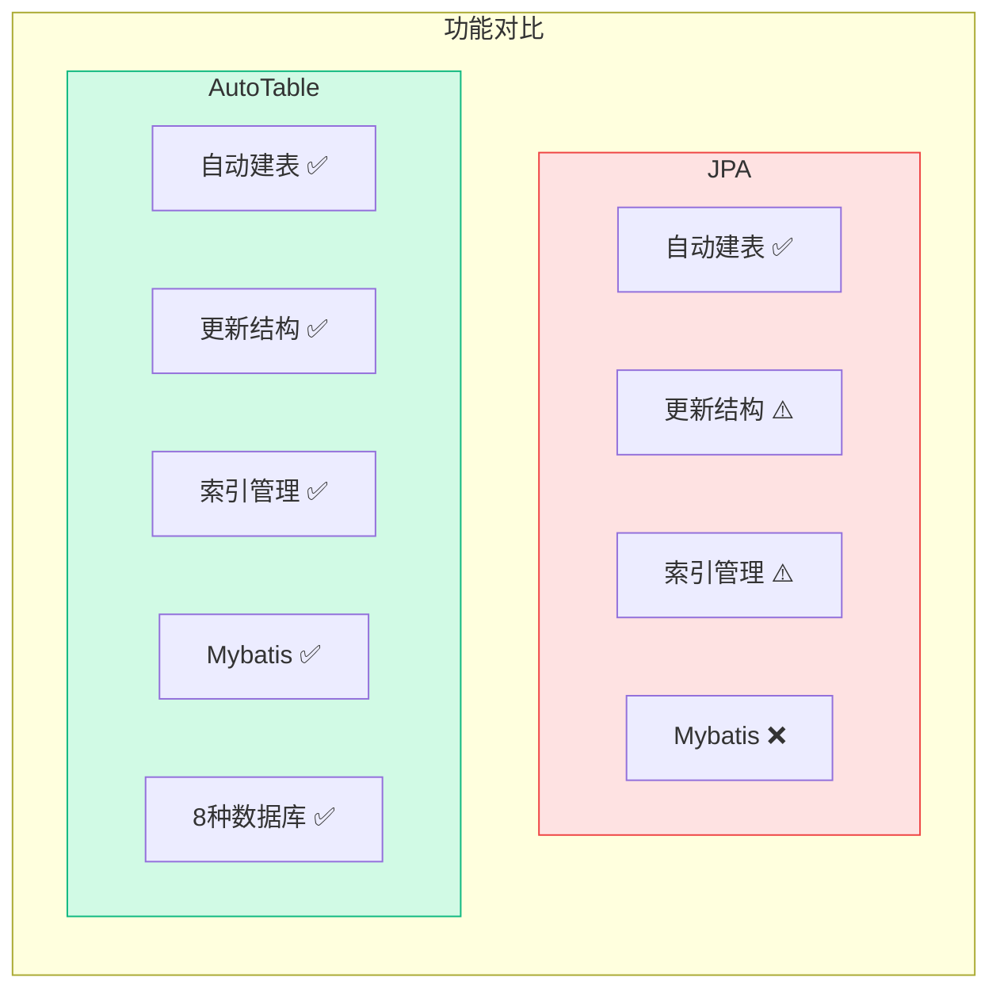
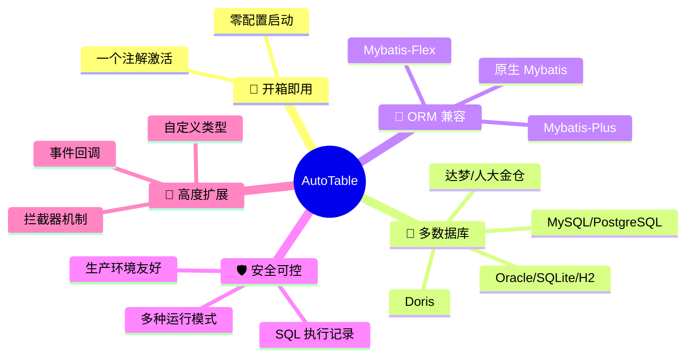
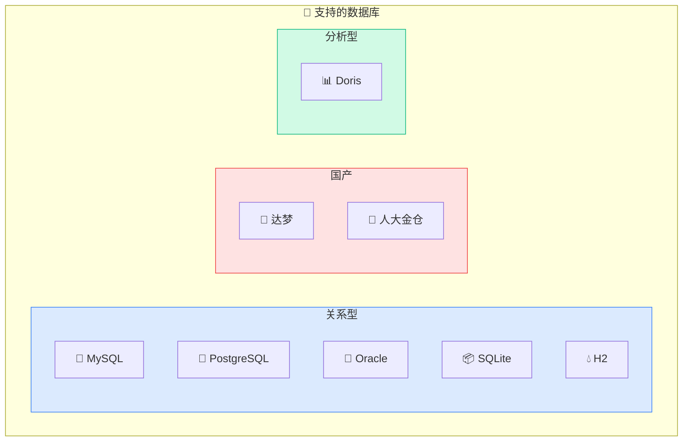

# 什么是 AutoTable？

AutoTable 是一个 **自动维护数据库表结构** 的框架，让你专注于业务逻辑和实体定义，无需手动管理数据库的表、列、索引。

> 你只负责维护实体，数据库的事交给我。

## 工作流程


## 为什么选择 AutoTable？

用过 `JPA` 的开发者都知道，JPA 有一项重要的能力就是表结构自动维护。但在非 `JPA` 的生态中，一直缺少这种体验。

**AutoTable 应运而生**，不仅填补了这一空白，功能更是强于 JPA：



| 特性 | JPA | AutoTable |
|------|-----|-----------|
| 自动建表 | ✅ | ✅ |
| 自动更新表结构 | ⚠️ 有限 | ✅ 完整 |
| 索引管理 | ⚠️ 基础 | ✅ 完整 |
| 多数据库支持 | ✅ | ✅ 8种+ |
| Mybatis 生态 | ❌ | ✅ |
| 字段顺序保持 | ❌ | ✅ MySQL |

## 核心特性



### 🚀 开箱即用
只需添加一个注解 `@AutoTable`，即可激活表结构自动维护。

### 🔌 多数据库支持
- **关系型数据库**：MySQL、PostgreSQL、Oracle、SQLite、H2
- **国产数据库**：达梦、人大金仓
- **分析型数据库**：Doris

### 🎯 ORM 框架兼容
- [Mybatis-Plus](https://gitee.com/dromara/mybatis-plus-ext)（通过 MyBatisPlusExt）
- [Mybatis-Flex](https://gitee.com/tangzc/mybatis-flex-ext)（通过 MyBatisFlexExt）
- 原生 Mybatis

### 🛡️ 安全可控
- 多种运行模式：`validate`、`update`、`create`
- 生产环境友好，支持仅校验不修改
- SQL 执行记录，便于审计

### 🔧 高度可扩展
- 拦截器机制
- 事件回调
- 自定义类型映射
- 支持扩展新数据库

## 支持的数据库



| 数据库 | 测试版本 | 状态 | 维护者 |
|--------|----------|------|--------|
| MySQL | 5.7+ | ✅ 稳定 | |
| MariaDB | 对应 MySQL 版本 | ✅ 稳定 | |
| PostgreSQL | 15.5 | ✅ 稳定 | |
| SQLite | 3.35.5 | ✅ 稳定 | |
| H2 | 2.2.220 | ✅ 稳定 | |
| Oracle | 11g / 23ai | ✅ 稳定 | [@lizhian](https://gitee.com/lizhian) |
| Doris | 2.0 | ✅ 稳定 | [@lizhian](https://gitee.com/lizhian) |
| 达梦 | dm8 | ✅ 稳定 | [@minfc](https://gitee.com/minfc) |
| 人大金仓 | V009R001C002B0014 | ✅ 稳定 | [@minfc](https://gitee.com/minfc) |

::: tip 期待你的贡献
其他数据库暂未支持，期待你的 PR 😉
:::

## 快速体验


```java
@Data
@AutoTable(comment = "用户表")
public class User {
    
    @PrimaryKey(autoIncrement = true)
    private Long id;
    
    @ColumnComment("用户名")
    @ColumnNotNull
    private String username;
    
    @ColumnComment("邮箱")
    @Index
    private String email;
    
    @ColumnDefault("0")
    private Integer status;
}
```

启动应用后，AutoTable 会自动：


1. 创建 `user` 表（如果不存在）
2. 添加所有字段及约束
3. 创建 `email` 字段的索引
4. 后续修改实体，自动同步表结构

准备好了吗？[立即开始 →](/快速开始/安装)
