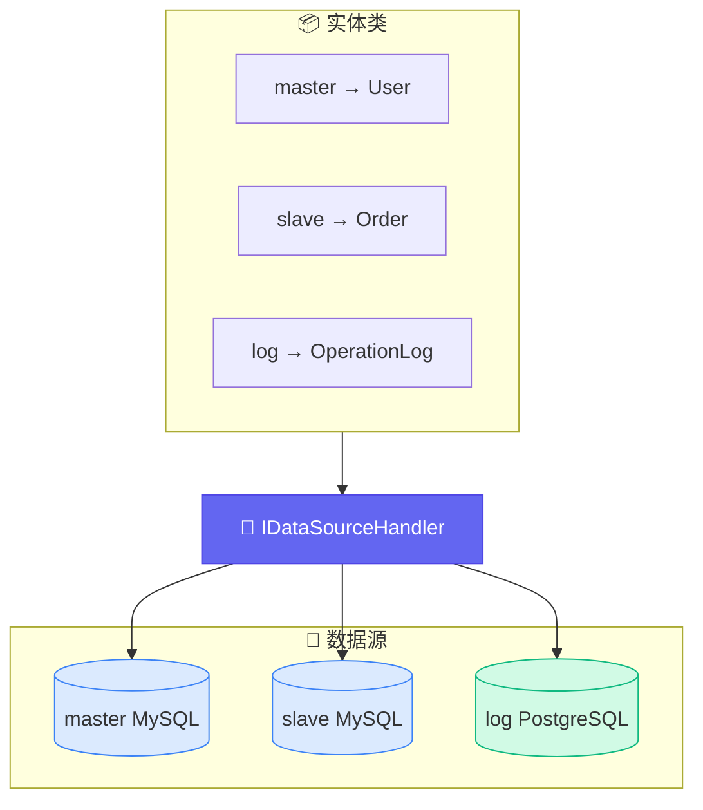
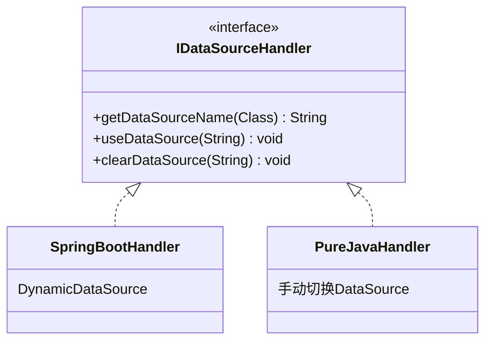
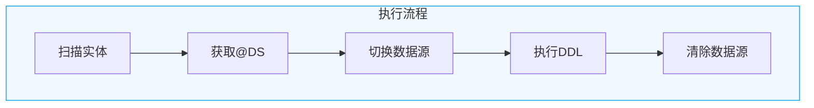
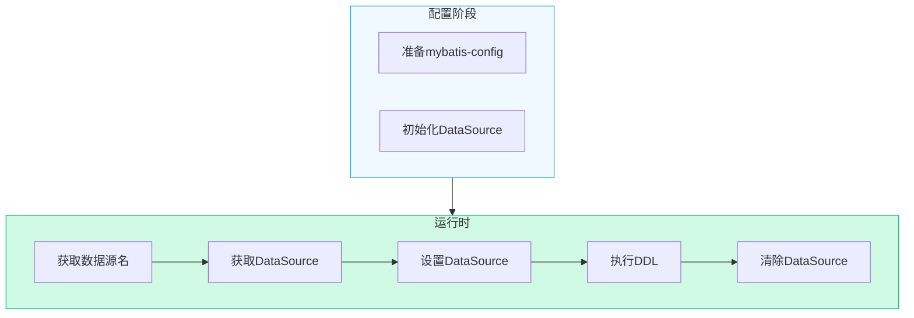
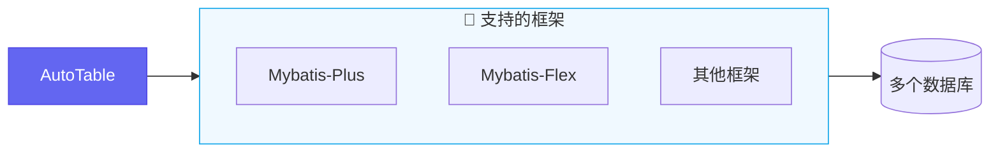

# 多数据源

AutoTable 内部支持多数据源，提供了自定义数据源的切换接口。

## 工作原理



## 核心接口



| 方法 | 说明 |
|------|------|
| `getDataSourceName()` | 根据实体类获取数据源名称 |
| `useDataSource()` | 切换到指定数据源 |
| `clearDataSource()` | 清除数据源（恢复默认） |

## Spring Boot 应用



::: warning 提醒
不同框架数据源标注方式不同，此处假设使用 `@DS(value:String)` 注解标注不同的数据源
:::

```java
@Component
public class MyDataSourceHandler implements IDataSourceHandler {

    /**
     * 根据实体类获取对应的数据源名称
     */
    @Override
    public String getDataSourceName(Class<?> clazz) {
        Ds ds = clazz.getAnnotation(Ds.class);
        if (ds != null) {
            return ds.value();
        }
        return DynamicDataSourceContextHolder.getContextKey();
    }

    /**
     * 切换数据源
     */
    @Override
    public void useDataSource(String dataSourceName) {
        DynamicDataSourceContextHolder.setContextKey(dataSourceName);
    }

    /**
     * 清除数据源
     */
    @Override
    public void clearDataSource(String dataSourceName) {
        DynamicDataSourceContextHolder.removeContextKey();
    }
}
```

### 实体示例

```java
@Data
@AutoTable
@DS("master")  // 主库
public class User {
    @PrimaryKey
    private Long id;
    private String username;
}

@Data
@AutoTable
@DS("slave")  // 从库
public class Order {
    @PrimaryKey
    private Long id;
    private Long userId;
    private BigDecimal amount;
}
```

## 普通 Java 应用



```java
public class DynamicDataSourceHandler implements IDataSourceHandler {

    private static final Map<String, String> CONFIG_MAP = new HashMap<>() {{
        put("mysql", "mybatis-config.xml");
        put("pgsql", "mybatis-config-pgsql.xml");
        put("sqlite", "mybatis-config-sqlite.xml");
    }};
    
    private static final Map<String, DataSource> DATA_SOURCE_MAP = new HashMap<>();

    @Override
    public void useDataSource(String dataSourceName) {
        DataSource dataSource = DATA_SOURCE_MAP.computeIfAbsent(
            dataSourceName, 
            this::createDataSource
        );
        // 设置新的 dataSource
        DataSourceManager.setDataSource(dataSource);
    }

    @Override
    public void clearDataSource(String dataSourceName) {
        DataSourceManager.cleanDataSource();
    }

    @Override
    public String getDataSourceName(Class<?> clazz) {
        Ds annotation = clazz.getAnnotation(Ds.class);
        return annotation != null ? annotation.value() : "mysql";
    }
    
    private DataSource createDataSource(String name) {
        String resource = CONFIG_MAP.get(name);
        try (InputStream is = getClass().getClassLoader()
                .getResourceAsStream(resource)) {
            SqlSessionFactory factory = new SqlSessionFactoryBuilder().build(is);
            return factory.getConfiguration().getEnvironment().getDataSource();
        } catch (Exception e) {
            throw new RuntimeException(e);
        }
    }
}
```

::: tip 说明
Spring Boot 中不需要手动设置 `SqlSessionFactory`，因为 Spring 保持了单实例，
AutoTable 的 starter 包在初始化时已自动配置。
:::

## 第三方框架集成



如果使用 Mybatis-Plus、Mybatis-Flex 等框架，它们都有成熟的多数据源方案，
AutoTable 可以良好集成，参考 [框架集成](/框架集成/)。

## 下一步

- 查看 [Mybatis-Plus 集成](/框架集成/Mybatis-Plus)
- 查看 [Mybatis-Flex 集成](/框架集成/Mybatis-Flex)
