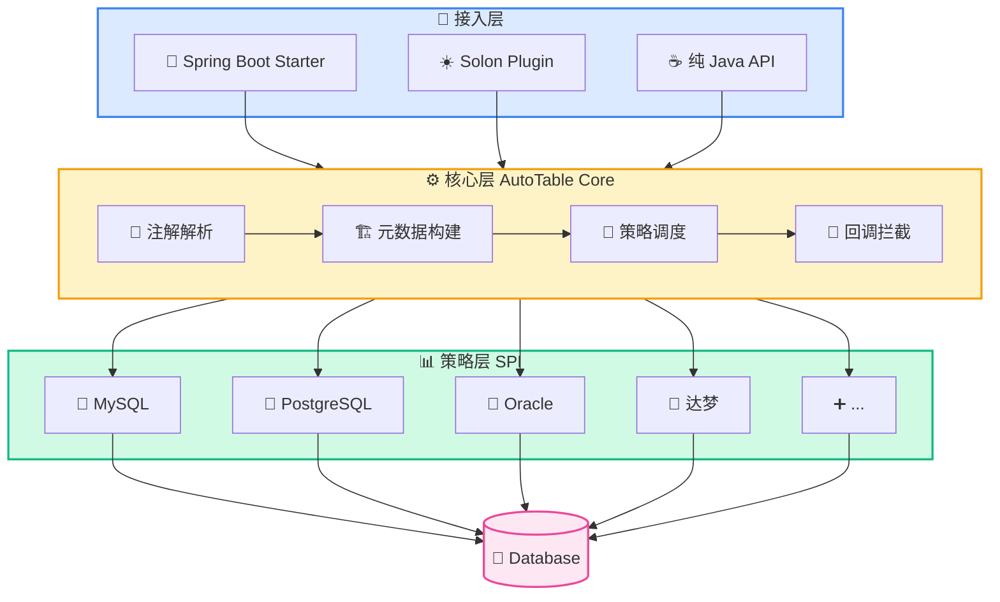
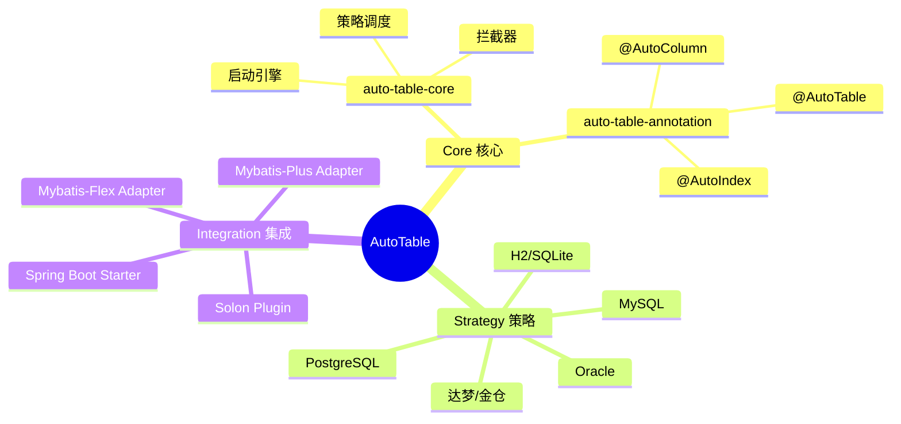
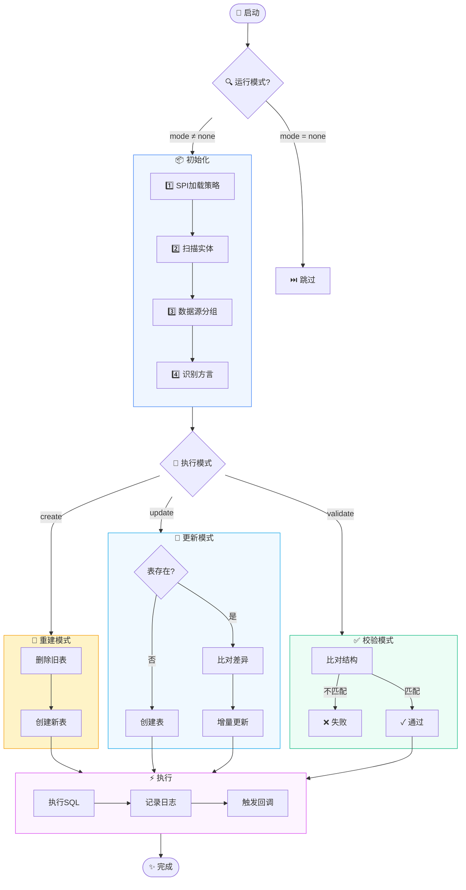
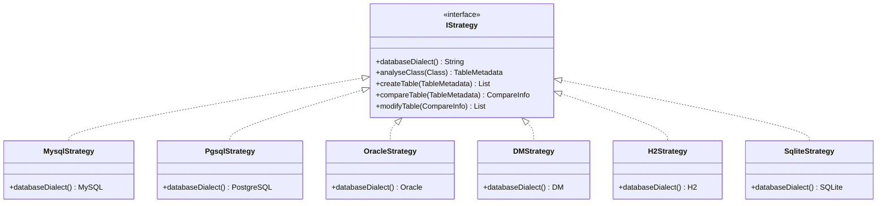
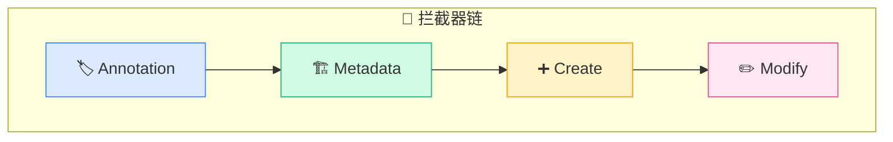
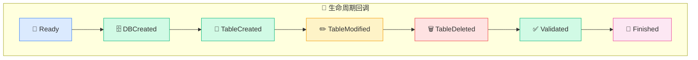

# 工作原理

## 架构概览

AutoTable 采用 **策略模式 + SPI 机制** 设计，核心模块职责清晰：



## 模块说明



## 执行流程



## 策略模式

每种数据库都有对应的策略实现：



**SPI 配置文件：**

```
META-INF/services/org.dromara.autotable.core.strategy.IStrategy
```

## 拦截器链



| 拦截器 | 触发时机 | 用途 |
|--------|----------|------|
| `AutoTableAnnotationInterceptor` | 注解扫描前 | 修改扫描的注解集合 |
| `BuildTableMetadataInterceptor` | 元数据构建后 | 修改表元数据（如国际化注释） |
| `CreateTableInterceptor` | 建表前 | 建表前的自定义处理 |
| `ModifyTableInterceptor` | 改表前 | 改表前的自定义处理 |

## 回调事件



| 回调 | 触发时机 |
|------|----------|
| `AutoTableReadyCallback` | 启动前，配置完成 |
| `CreateDatabaseFinishCallback` | 数据库创建后 |
| `CreateTableFinishCallback` | 表创建后 |
| `ModifyTableFinishCallback` | 表修改后 |
| `DeleteTableFinishCallback` | 表删除后 |
| `ValidateFinishCallback` | 校验完成后 |
| `AutoTableFinishCallback` | 全部执行完成 |

## 下一步

- 了解 [运行模式](/核心概念/运行模式) 的选择
- 查看 [拦截器](/高级功能/拦截器) 使用方法
- 学习 [自定义策略](/高级功能/自定义策略) 扩展新数据库
