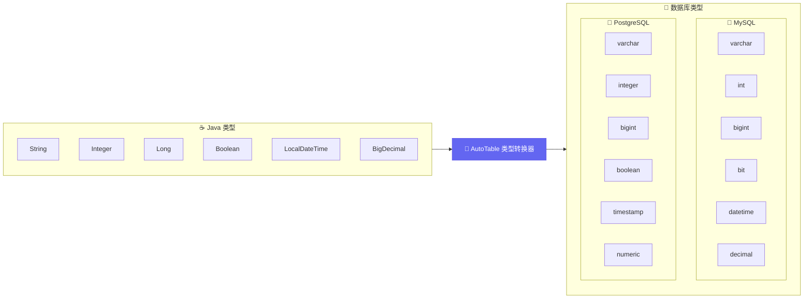
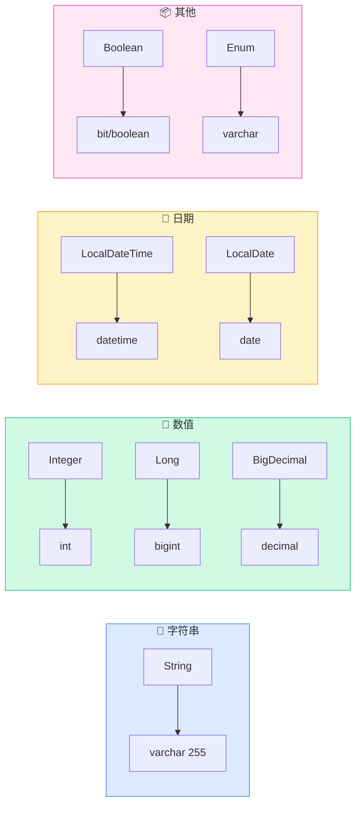
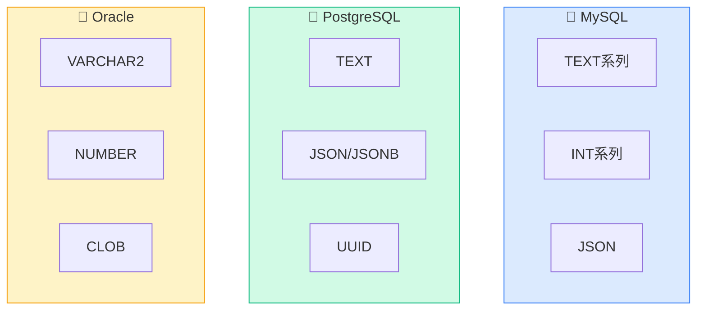
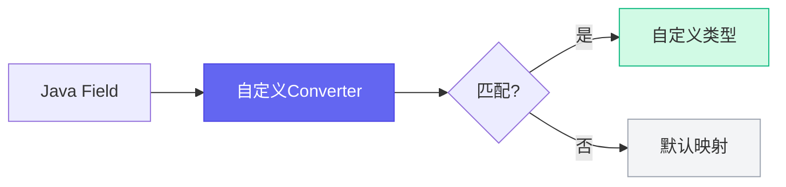

# 类型映射

AutoTable 会自动将 Java 类型映射为对应的数据库类型。

## 映射流程



## 默认映射规则

### 通用映射



| Java 类型 | MySQL | PostgreSQL | Oracle |
|-----------|-------|------------|--------|
| `String` | `varchar(255)` | `varchar(255)` | `varchar2(255)` |
| `Integer` / `int` | `int` | `integer` | `number(10)` |
| `Long` / `long` | `bigint` | `bigint` | `number(19)` |
| `Boolean` / `boolean` | `bit(1)` | `boolean` | `number(1)` |
| `Double` / `double` | `double` | `double precision` | `number` |
| `Float` / `float` | `float` | `real` | `number` |
| `BigDecimal` | `decimal(10,2)` | `numeric(10,2)` | `number(10,2)` |
| `Date` | `datetime` | `timestamp` | `date` |
| `LocalDateTime` | `datetime` | `timestamp` | `timestamp` |
| `LocalDate` | `date` | `date` | `date` |
| `LocalTime` | `time` | `time` | `timestamp` |
| `byte[]` | `blob` | `bytea` | `blob` |
| `Enum` | `varchar(255)` | `varchar(255)` | `varchar2(255)` |

### 特殊类型

| Java 类型 | 说明 |
|-----------|------|
| 枚举类 | 默认存储枚举名称（String），可自定义 |
| 嵌套对象 | 不支持，需 `@Ignore` 忽略 |
| 集合类型 | 不支持，需 `@Ignore` 忽略 |

## 自定义类型

### 使用 @ColumnType

```java
@Data
@AutoTable
public class Article {
    
    // 指定类型和长度
    @ColumnType(value = "varchar", length = 100)
    private String title;
    
    // MySQL 大文本
    @ColumnType("longtext")
    private String content;
    
    // 精确小数
    @ColumnType(value = "decimal", length = 18, decimalLength = 4)
    private BigDecimal price;
}
```

### 使用 @AutoColumn

```java
@AutoColumn(type = "text", comment = "文章内容")
private String content;
```

## 数据库专属类型



### MySQL 特有类型

```java
// MySQL 类型常量
import org.dromara.autotable.annotation.mysql.MysqlTypeConstant;

@ColumnType(MysqlTypeConstant.LONGTEXT)
private String content;

@ColumnType(MysqlTypeConstant.JSON)
private String jsonData;

@ColumnType(MysqlTypeConstant.TINYINT)
private Integer status;
```

常用 MySQL 类型：
- `TINYINT`, `SMALLINT`, `MEDIUMINT`, `INT`, `BIGINT`
- `FLOAT`, `DOUBLE`, `DECIMAL`
- `CHAR`, `VARCHAR`, `TEXT`, `MEDIUMTEXT`, `LONGTEXT`
- `DATE`, `DATETIME`, `TIMESTAMP`, `TIME`
- `BLOB`, `MEDIUMBLOB`, `LONGBLOB`
- `JSON`, `ENUM`, `SET`

### PostgreSQL 特有类型

```java
import org.dromara.autotable.annotation.pgsql.PgsqlTypeConstant;

@ColumnType(PgsqlTypeConstant.TEXT)
private String content;

@ColumnType(PgsqlTypeConstant.JSONB)
private String jsonData;
```

## 多数据库适配

当需要同时支持多种数据库时，使用 `@AutoColumns`：

```java
@AutoColumns({
    @AutoColumn(type = "longtext", dialect = "MySQL"),
    @AutoColumn(type = "text", dialect = "PostgreSQL"),
    @AutoColumn(type = "clob", dialect = "Oracle")
})
private String content;
```

## 全局类型映射

### 自定义转换器



实现 `JavaTypeToDatabaseTypeConverter` 接口：

```java
@Component
public class CustomTypeConverter implements JavaTypeToDatabaseTypeConverter {
    
    @Override
    public DatabaseTypeAndLength convert(String databaseDialect, 
                                         Class<?> fieldType, 
                                         Field field) {
        // MySQL 下 String 默认使用 text
        if ("MySQL".equals(databaseDialect) && fieldType == String.class) {
            return new DatabaseTypeAndLength("text", null, null);
        }
        // 返回 null 使用默认映射
        return null;
    }
}
```

### 添加新类型映射

```java
// 启动时注册
JavaTypeToDatabaseTypeConverter.addTypeMapping(
    "MySQL",  // 数据库方言
    Map.of(
        MyCustomType.class, MysqlTypeConstant.JSON
    )
);
```

## 枚举类型处理

默认存储枚举名称：

```java
public enum Status {
    ACTIVE, INACTIVE, DELETED
}

@AutoTable
public class User {
    private Status status;  // 数据库：varchar(255)，值：ACTIVE
}
```

自定义枚举值：

```java
// 通过 ORM 框架的枚举处理器自定义
// 如 Mybatis-Plus 的 @EnumValue
```

## 下一步

- 了解 [多数据源](/核心概念/多数据源) 配置
- 查看各 [数据库适配](/数据库适配/) 的类型详情
