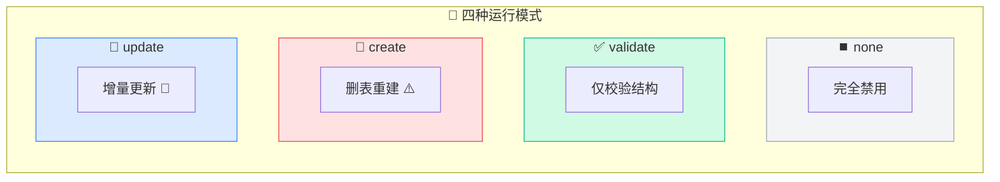
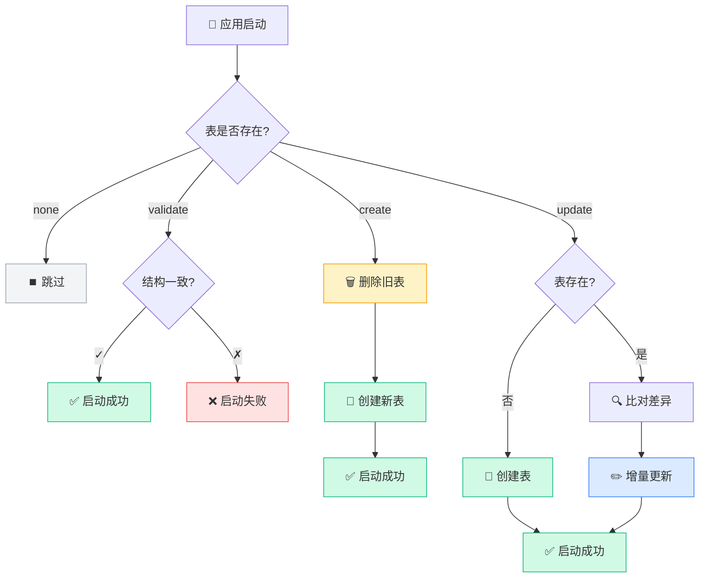
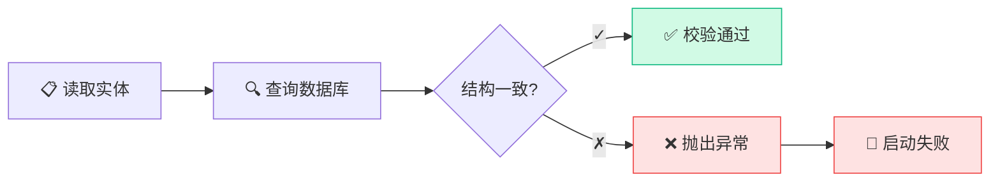
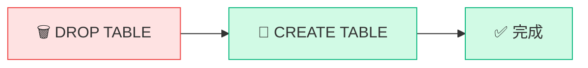
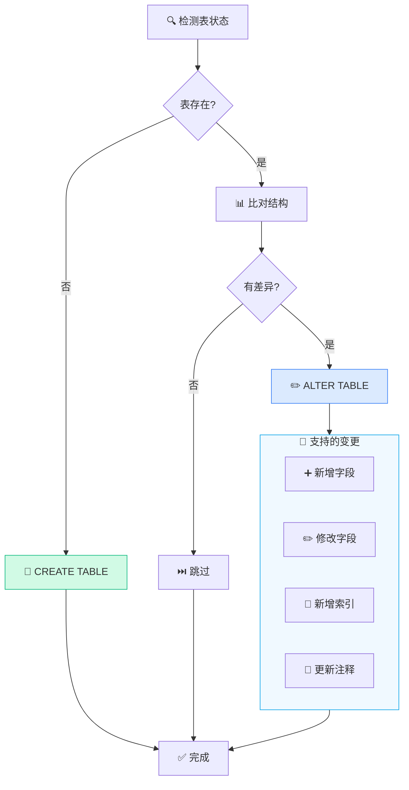
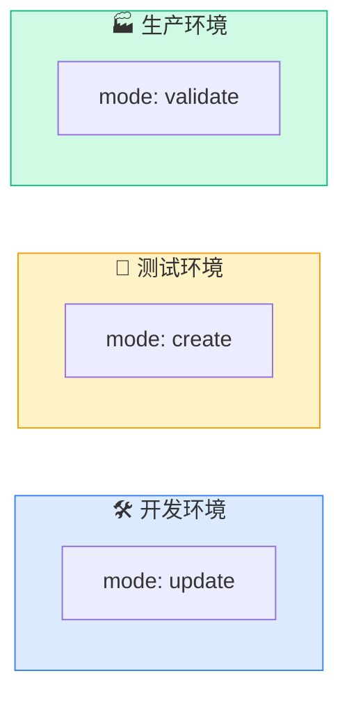

# 运行模式

AutoTable 提供四种运行模式，适用于不同场景。

## 模式概览



| 模式 | 行为 | 适用场景 |
|------|------|----------|
| `none` | 不执行任何操作 | 完全禁用 |
| `validate` | 仅校验，不修改 | **生产环境** |
| `create` | 删表重建 | 测试环境初始化 |
| `update` | 增量更新 | **开发环境**（默认） |

## 模式对比



## none 模式

```yaml
auto-table:
  mode: none
```

**行为**：完全跳过 AutoTable 逻辑，等同于 `enable: false`。

**适用场景**：
- 临时禁用自动建表
- 特殊环境不需要表结构维护

## validate 模式

```yaml
auto-table:
  mode: validate
```



**行为**：
1. 检查数据库中的表是否存在
2. 比对表结构与实体定义是否一致
3. **不一致则启动失败**，抛出异常
4. 不执行任何 DDL 语句

**适用场景**：
- ✅ **生产环境推荐**
- 确保代码与数据库结构一致
- 及早发现结构不匹配问题

**示例错误**：
```
启动失败，MySQL 数据表 user 与实体不匹配：
- 字段 phone 在实体中存在，但数据库中不存在
- 索引 auto_idx_email 在实体中存在，但数据库中不存在
```

## create 模式

```yaml
auto-table:
  mode: create
```



**行为**：
1. **删除**所有实体标注的表
2. 根据实体定义**重新创建**表

::: danger 警告
此模式会**清空所有数据**，仅用于测试环境！
:::

**适用场景**：
- 测试环境初始化
- 需要干净的表结构
- 自动化测试前置准备

## update 模式

```yaml
auto-table:
  mode: update
```



**默认行为**：
- ✅ 会新增字段
- ✅ 会修改字段属性
- ✅ 会新增索引
- ❌ **不会删除字段**（需配置 `auto-drop-column: true`）
- ⚠️ 会删除框架创建的索引（`auto_idx_` 前缀）

**适用场景**：
- ✅ **开发环境推荐**（默认模式）
- 快速迭代，自动同步表结构

## 环境配置建议



### 开发环境

```yaml
auto-table:
  mode: update
  show-banner: true
  auto-drop-column: false  # 不自动删除字段，避免误删
```

### 测试环境

```yaml
auto-table:
  mode: create  # 每次启动重建表
```

### 生产环境

```yaml
auto-table:
  mode: validate  # 仅校验，不修改
  # 或者完全禁用
  # enable: false
```

## 字段删除控制

默认情况下，`update` 模式不会删除字段。如需自动删除：

```yaml
auto-table:
  mode: update
  auto-drop-column: true  # 开启字段删除
```

::: warning 注意
开启后，实体中移除的字段会从数据库删除，**数据不可恢复**。
建议仅在开发环境开启。
:::

## 索引删除控制

```yaml
auto-table:
  # 删除框架创建的多余索引（auto_idx_ 前缀）
  auto-drop-index: true  # 默认 true
  
  # 删除用户自定义的索引（非 auto_idx_ 前缀）
  auto-drop-custom-index: false  # 默认 false
```

## 下一步

- 了解 [类型映射](/核心概念/类型映射) 规则
- 查看完整 [配置项](/API参考/配置项)
- 学习 [生产环境部署](/最佳实践/生产环境部署) 最佳实践
