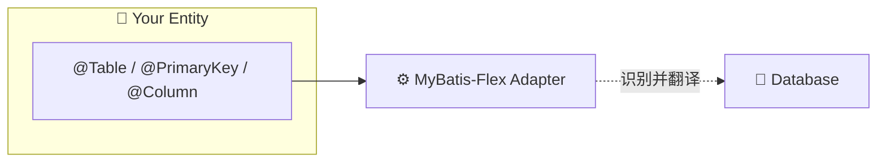

<div style="display: flex; justify-content: center;">
    
</div>

## 💡 核心价值：零侵入式集成

AutoTable 适配器让您**无需引入任何 AutoTable 注解**即可享受自动建表能力：

### 🚀 极简演示

#### 第一步：引入依赖

```xml
<!-- 只加这一个 Starter 就够了 -->
<dependency>
    <groupId>org.dromara.autotable</groupId>
    <artifactId>auto-table-adapter-mybatis-flex-spring-boot-starter</artifactId>
    <version>{{version}}</version>
</dependency>
```

#### 第二步：定义实体（完全用 MF 原生注解）

```java
import com.mybatisflex.annotation.Table;
import com.mybatisflex.annotation.Column;
import com.mybatisflex.annotation.PrimaryKey;
import com.mybatisflex.annotation.IdType;

@Table("sys_user")  // ← 只用 MF 的 @Table
public class User {
    
    @PrimaryKey(value = "id", type = IdType.AUTO)  // ← 只用 MF 的 @PrimaryKey
    private Long id;
    
    @Column("username")
    private String username;
    
    @Column("email")
    private String email;
}
```

#### 第三步：启动应用

```java
import com.mybatisflex.spring.boot.autoconfigure.MybatisFlexAutoConfiguration;
import org.springframework.boot.SpringApplication;
import org.springframework.boot.autoconfigure.SpringBootApplication;

@SpringBootApplication
public class Application {
    public static void main(String[] args) {
        SpringApplication.run(Application.class, args);
    }
}
```

✨ **完成！** 启动后 AutoTable 会自动：
- 识别所有 `@Table` 标注的实体
- 根据 `@PrimaryKey`、`@Column` 解析字段
- 自动创建数据库表结构
- 后续修改实体，表结构自动同步

**就这么简单！不需要写一行 AutoTable 的代码！**

## 详细说明

### 工作原理

AutoTable 通过**适配器机制**自动识别和转换 MF 注解：



**核心组件：**
- `MybatisFlexAutoTableClassScanner`：自动扫描实体类上的 `@Table`
- `MybatisFlexMetadataAdapter`：解析 `@PrimaryKey`、`@Column` 等注解
- `MybatisFlexJavaTypeToDatabaseTypeConverter`：处理类型映射（枚举、Date 等）
- `MybatisFlexRunBeforeCallback`：在 DDL 执行前屏蔽 MF 拦截器插件

### 支持的 MF 注解

AutoTable 会智能识别所有标准 MF 注解：

| MF 注解 | 作用 | AutoTable 支持 |
|--------|------|---------------|
| `@Table` | 定义表名 | ✅ 自动识别 |
| `@PrimaryKey` | 定义主键 | ✅ 支持所有 IdType |
| `@Column` | 定义字段 | ✅ 支持 value、ignoreInsert、ignoreUpdate |
| `@TableLogic` | 逻辑删除标记 | ✅ 自动识别 |
| `@TableId` | 主键别名 | ✅ 兼容支持 |

### 与 Mybatis-Flex-Ext 的关系

如果您使用 [Mybatis-Flex-Ext](https://gitee.com/tangzc/mybatis-flex-ext)（扩展版 MF），建议：

```xml
<!-- 同时引入 MFE 和 AutoTable -->
<dependency>
    <groupId>com.github.tangzc</groupId>
    <artifactId>mybatis-flex-ext-spring-boot-starter</artifactId>
    <version>X.X.X</version>
</dependency>
<dependency>
    <groupId>org.dromara.autotable</groupId>
    <artifactId>auto-table-adapter-mybatis-flex-spring-boot-starter</artifactId>
    <version>{{version}}</version>
</dependency>
```

这样您可以同时享受：
- MFE 的代码生成、数据自动填充等功能
- AutoTable 的自动建表功能
- 两者完美结合，互不干扰

## ⚠️ 关于 2.6.2 版本变更

> ### 💡 重要提示
> 
> AutoTable 2.6.2 版本新增了 MyBatis-Flex 适配器，对 MP 适配器进行了重构（移除了扩展注解）。
> 
> #### 🎯 我的影响？
> 
> - **MyBatis-Flex 用户**：✅ 无影响！MF 适配器从一开始就使用原生注解
> - **MyBatis-Plus 用户**：⚠️ 如有使用扩展注解，需要迁移到标准注解

## 配置项

### 自动建库模式

```yaml
auto-table:
  create-database-enabled: true  # 默认 false，自动创建数据库
  database-url: jdbc:mysql://localhost:3306  # 连库 URL
```

### 运行模式

| 模式 | 说明 | 推荐环境 |
|------|------|---------|
| `validate`（默认） | 只校验不修改 | 生产环境 |
| `update` | 自动更新差异 | 开发环境 |
| `create` | 创建缺失表 | 测试环境 |

```yaml
auto-table:
  mode: update
```

### SQL 记录

记录每次执行的 SQL，方便审计和排查问题：

```yaml
auto-table:
  record-sql-enabled: true
  record-sql-type: DB  # 文件 (FILE) 或 数据库 (DB)
```

### 表名前缀

如果实体上有 `@Table(prefix = "sys_")`，AutoTable 会自动识别：

```yaml
# 也可以在全局配置表名前缀
auto-table:
  table-prefix: sys_  # 可选，优先使用注解
```

## 高级特性

### 动态数据源支持

如果使用了 dynamic-datasource，AutoTable 会自动识别：

```yaml
spring:
  datasource:
    dynamic:
      primary: master
      datasource:
        master:
          url: jdbc:mysql://localhost:3306/db_master
        slave:
          url: jdbc:mysql://localhost:3306/db_slave
```

每个数据源的初始化脚本可以放在：
```
classpath:sql/master/_init_.sql
classpath:sql/slave/_init_.sql
```

### Schema 支持

对于 PostgreSQL、Oracle、Doris 等多 Schema 数据库：

```java
@Table(schema = "public", value = "user")
public class User {
    // ...
}
```

AutoTable 会自动创建对应的 Schema 和表。

### 忽略字段

使用 `@Column(ignore = true)` 或 `@Table(excludeProperty = "field")` 标记的字段会被忽略，不会在数据库中创建。

## 常见问题

### 表未创建？

1. 检查是否引入了 starter 依赖
2. 确认实体上有 `@Table` 注解
3. 查看日志是否有错误信息

### 字段未更新？

1. 确认运行模式为 `update`
2. 检查字段是否被 `@Column(ignore = true)` 标记
3. 确认不是 `static` 或 `final` 字段

### Invalid value type 错误？

通常是类型映射问题：
1. 检查 Java 类型是否能转换为数据库类型
2. 复杂类型可以自定义 TypeHandler

## 相关资源

- [GitHub 仓库](https://github.com/dromara/auto-table)
- [Gitee 仓库](https://gitee.com/tangzc/auto-table)
- [MyBatis-Flex 官方文档](https://mybatis-flex.com/)
- [MyBatis-Flex-Ext](https://gitee.com/tangzc/mybatis-flex-ext)
- [更新日志](/更新日志)
- [最佳实践](/最佳实践/生产环境部署)

## 社区支持

如有问题或建议，欢迎：
- 提交 Issue：[Gitee Issues](https://gitee.com/tangzc/auto-table/issues)
- 参与讨论：[贡献指南](/社区/贡献指南)

感谢每一位贡献者！🌟
