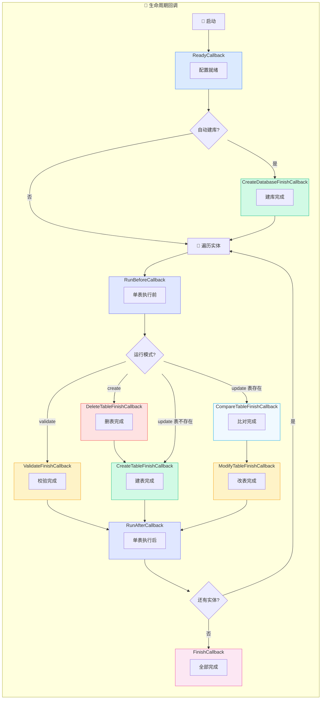
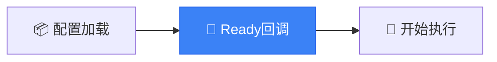
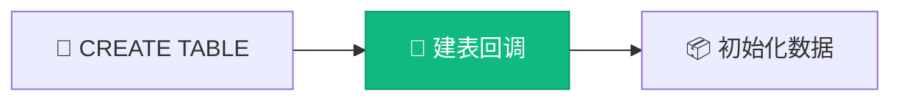
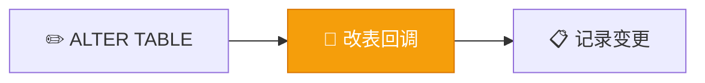
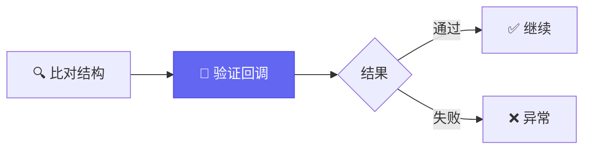
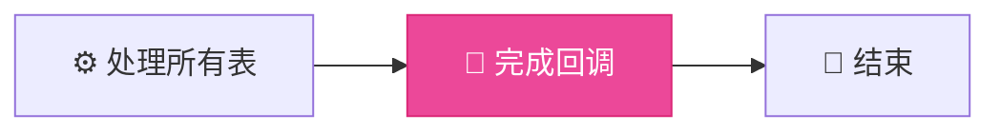

# 事件回调

AutoTable 在执行过程中提供了丰富的回调接口，方便监听表的创建、修改等事件。

## 回调全景



## 回调列表

| 回调 | 触发时机 | 说明 |
|------|----------|------|
| `AutoTableReadyCallback` | 配置就绪后 | 可做自定义初始化 |
| `CreateDatabaseFinishCallback` | 建库后 | 自动建库开启时 |
| `RunBeforeCallback` | 单表执行前 | 每个表执行前触发 |
| `ValidateFinishCallback` | 校验后 | validate 模式 |
| `DeleteTableFinishCallback` | 删表后 | create 模式删表 |
| `CreateTableFinishCallback` | 建表后 | 新表创建完成 |
| `CompareTableFinishCallback` | 比对后 | 表结构比对完成 |
| `ModifyTableFinishCallback` | 改表后 | 表结构变更完成 |
| `RunAfterCallback` | 单表执行后 | 每个表执行后触发 |
| `AutoTableFinishCallback` | 全部完成 | 所有表处理完成 |

## AutoTableReadyCallback

配置已经注入完成，准备执行前的回调。



```java
public interface AutoTableReadyCallback {
    void ready(final Set<Class<?>> tableClasses);
}
```

**使用场景**：自定义配置初始化、预处理实体集合、日志记录

## CreateDatabaseFinishCallback

自动建库完成后的回调。

```java
@FunctionalInterface
public interface CreateDatabaseFinishCallback {
    void afterCreateDatabase(String dataSource, Set<Class<?>> classes, 
                             DataSourceInfoExtractor.DbInfo dbInfo);
}
```

**使用场景**：建库后执行初始化脚本

## RunBeforeCallback / RunAfterCallback

单个表执行前后的回调。


```java
public interface RunBeforeCallback {
    void before(final Class<?> tableClass);
}

public interface RunAfterCallback {
    void after(final Class<?> tableClass);
}
```

## CreateTableFinishCallback

建表完成后的回调。



```java
@FunctionalInterface
public interface CreateTableFinishCallback {
    void afterCreateTable(String databaseDialect, final TableMetadata tableMetadata);
}
```

**使用场景**：初始化表数据、记录建表日志、触发后续业务

## CompareTableFinishCallback

表结构比对完成后的回调（update 模式下触发）。

```java
@FunctionalInterface
public interface CompareTableFinishCallback {
    void afterCompareTable(String databaseDialect, 
                           final TableMetadata tableMetadata, 
                           final CompareTableInfo compareTableInfo);
}
```

**使用场景**：记录结构差异、自定义变更审批

## ModifyTableFinishCallback

修改表完成后的回调。



```java
@FunctionalInterface
public interface ModifyTableFinishCallback {
    void afterModifyTable(String databaseDialect, 
                          final TableMetadata tableMetadata, 
                          final CompareTableInfo compareTableInfo);
}
```

**使用场景**：记录变更历史、发送变更通知、数据迁移

## DeleteTableFinishCallback

删除表完成后的回调（create 模式下触发）。

```java
@FunctionalInterface
public interface DeleteTableFinishCallback {
    void afterDeleteTables(String schema, final String tableName);
}
```

## ValidateFinishCallback

验证模式下，验证完成后的回调。



```java
@FunctionalInterface
public interface ValidateFinishCallback {
    void validateFinish(boolean status, String databaseDialect, 
                        final CompareTableInfo compareTableInfo);
}
```

## AutoTableFinishCallback

全部执行完成后的回调。



```java
public interface AutoTableFinishCallback {
    void finish(final Set<Class<?>> tableClasses);
}
```

**使用场景**：清理临时资源、统计执行结果、触发后续初始化

## 使用示例

### Spring Boot

```java
@Component
public class MyTableCallback implements CreateTableFinishCallback {
    
    @Override
    public void afterCreateTable(String databaseDialect, 
                                  TableMetadata tableMetadata) {
        log.info("表 {} 创建完成", tableMetadata.getTableName());
    }
}
```

### 普通 Java

```java
AutoTableGlobalConfig.instance().getCreateTableFinishCallbacks()
    .add((dialect, metadata) -> {
        System.out.println("表 " + metadata.getTableName() + " 创建完成");
    });
```

## 下一步

- 了解 [拦截器](/高级功能/拦截器) 机制
- 查看 [工作原理](/核心概念/工作原理) 完整流程
