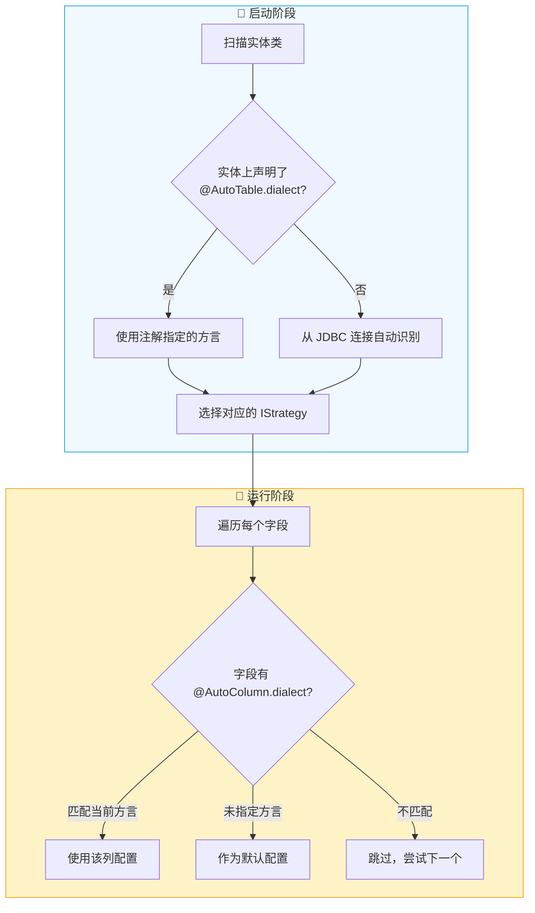

# 多数据库方言适配

AutoTable 通过 `dialect`（方言）属性提供了两个层级的多数据库适配能力：**表级方言**控制策略选择，**列级方言**控制列配置选择。合理运用这两个层级，可以用同一套代码适配多种数据库。

## 工作原理



### 方言的识别优先级

1. `@AutoTable(dialect = "...")` — 注解显式指定（最高优先级）
2. `AutoTableMetadataAdapter.getTableDialect()` — 编程式自定义（扩展点）
3. JDBC 连接 `DatabaseMetaData.getDatabaseProductName()` — 自动识别（默认）

::: tip 两个层级的区别
- **表级 `@AutoTable.dialect`**：决定框架使用哪套数据库策略（`IStrategy`），影响所有表结构的生成方式
- **列级 `@AutoColumn.dialect`**：在已确定的策略下，为同一字段选择不同的列定义（类型、长度等）
:::

## 场景一：MySQL 兼容库适配

OceanBase、TiDB 等数据库高度兼容 MySQL 协议，但其 JDBC 驱动返回的 `DatabaseProductName` 并非 `"MySQL"`，导致 AutoTable 无法自动匹配到 MySQL 策略。

此时可以通过 `@AutoTable(dialect = "MySQL")` 强制使用 MySQL 策略：

```java
// OceanBase 兼容模式下，强制走 MySQL 策略
@AutoTable(dialect = DatabaseDialect.MySQL)
public class User {
    @PrimaryKey(autoIncrement = true)
    private Long id;
    private String username;
}
```

::: tip 推荐配合 @MysqlEngine / @MysqlCharset 使用
当 `dialect` 指定为 `MySQL` 后，所有 MySQL 专属注解（`@MysqlEngine`、`@MysqlCharset`、`@MysqlColumnUnsigned` 等）都会正常生效。
:::

## 场景二：一套代码部署到多种数据库

当产品需要同时支持 MySQL、PostgreSQL、Oracle 等多种数据库时，不同数据库的字段类型、长度可能存在差异。使用 `@AutoColumns` 配合 `dialect` 属性，可以为同一字段定义多套配置，框架自动选择匹配的那一套：

```java
@AutoTable
public class Article {

    @PrimaryKey(autoIncrement = true)
    private Long id;

    // 标题：不同数据库使用不同长度
    @AutoColumns({
        @AutoColumn(length = 100, dialect = DatabaseDialect.MySQL),
        @AutoColumn(length = 200, dialect = DatabaseDialect.PostgreSQL),
        @AutoColumn(length = 50)  // 其他数据库的默认值
    })
    private String title;

    // 内容：不同数据库使用不同的大文本类型
    @ColumnComment("文章内容")
    @AutoColumns({
        @AutoColumn(type = "longtext", dialect = DatabaseDialect.MySQL),
        @AutoColumn(type = "text", dialect = DatabaseDialect.PostgreSQL),
        @AutoColumn(type = "clob", dialect = DatabaseDialect.Oracle)
    })
    private String content;

    // JSON 字段：不同数据库使用不同格式
    @AutoColumns({
        @AutoColumn(type = "json", dialect = DatabaseDialect.MySQL),
        @AutoColumn(type = "jsonb", dialect = DatabaseDialect.PostgreSQL),
        @AutoColumn(type = "text")  // 其他数据库退化为 text
    })
    private String metadata;
}
```

**匹配规则：**
1. 优先选择 `dialect` 与当前数据库一致的 `@AutoColumn`
2. 如果没有匹配的，使用未指定 `dialect` 的配置作为默认值
3. 多个配置按声明顺序优先匹配

::: warning 注意
`@AutoColumns` 中的子注解如果都没有指定 `dialect`，等同于只写了一个 `@AutoColumn`，没有多数据库适配效果。
:::

## 场景三：编程式控制方言

如果注解方式不够灵活（比如需要根据配置文件动态决定方言），可以实现 `AutoTableMetadataAdapter` 接口：

```java
@Component
public class MyMetadataAdapter implements AutoTableMetadataAdapter {

    @Value("${app.database.dialect:}")
    private String configuredDialect;

    @Override
    public String getTableDialect(Class<?> clazz) {
        // 根据配置动态返回方言，返回 null 则走自动识别
        if (StringUtils.hasText(configuredDialect)) {
            return configuredDialect;
        }
        return null;
    }
}
```

::: tip 优先级说明
`AutoTableMetadataAdapter` 的返回值仅在 `@AutoTable.dialect` **未设置**时生效。如果注解和适配器都指定了方言，注解优先。
:::

## 场景四：配合 initSql 按数据库初始化

`@AutoTable.initSql` 支持 `{dialect}` 占位符，可以根据当前数据库类型自动加载对应的 SQL 脚本：

```java
@AutoTable(initSql = "classpath:sql/{dialect}/user.sql")
public class User {
    // ...
}
```

```
src/main/resources/
└── sql/
    ├── MySQL/
    │   └── user.sql         # MySQL 初始化脚本
    ├── PostgreSQL/
    │   └── user.sql         # PostgreSQL 初始化脚本
    └── Oracle/
        └── user.sql         # Oracle 初始化脚本
```

> 详细的 initSql 用法参见 [数据初始化](/高级功能/数据初始化#方式二-手动指定-sql-脚本)

## DatabaseDialect 常量参考

`dialect` 的值必须与框架已注册的策略方言一致，建议使用 `DatabaseDialect` 常量避免拼写错误：

```java
import org.dromara.autotable.core.constants.DatabaseDialect;
```

| 常量名 | 值 | 说明 |
|--------|-----|------|
| `MySQL` | `MySQL` | MySQL |
| `MariaDB` | `MariaDB` | MariaDB |
| `PostgreSQL` | `PostgreSQL` | PostgreSQL |
| `Oracle` | `Oracle` | Oracle |
| `SQLServer` | `Microsoft SQL Server` | SQL Server |
| `SQLite` | `SQLite` | SQLite |
| `H2` | `H2` | H2 |
| `DM` | `DM DBMS` | 达梦 |
| `KingBase` | `KingbaseES` | 人大金仓 |
| `Doris` | `Doris` | Apache Doris |
| `OceanBase` | `OceanBase` | OceanBase |
| `TiDB` | `TiDB` | TiDB |
| `DB2` | `DB2` | IBM DB2 |
| `ClickHouse` | `ClickHouse` | ClickHouse |
| `GBase` | `GBase` | 南大通用 |
| `Shentong` | `Shentong` | 神通数据库 |
| `HuaweiGaussDB` | `GaussDB` | 华为 GaussDB |
| `Firebird` | `Firebird` | Firebird |
| `Informix` | `Informix` | Informix |
| `Sybase` | `Sybase` | Sybase |
| `Redshift` | `Redshift` | Amazon Redshift |
| `Vertica` | `Vertica` | Vertica |
| `Teradata` | `Teradata` | Teradata |

::: tip 自定义方言
如果以上常量都不满足需求，可以实现自定义 `IStrategy` 并注册，方言值由 `IStrategy.databaseDialect()` 的返回值决定。详见 [自定义策略](/高级功能/自定义策略)。
:::

## 约束与注意事项

### 同一数据源不能混用方言

同一个数据源下的所有实体，表级 `dialect` 必须一致（或为空），否则启动时会抛出异常：

```java
// ❌ 错误示例：同一数据源下指定了不同方言
@AutoTable(dialect = "MySQL")
public class User { }

@AutoTable(dialect = "PostgreSQL")  // 启动报错！
public class Order { }
```

### dialect 值必须匹配已注册的策略

`dialect` 的值必须与某个已注册的 `IStrategy.databaseDialect()` 返回值完全一致，否则框架会提示"没有找到对应的数据库方言策略"。

### 表级 vs 列级

| 维度 | 表级 `@AutoTable.dialect` | 列级 `@AutoColumn.dialect` |
|------|--------------------------|---------------------------|
| 作用 | 选择数据库策略 | 选择列配置 |
| 影响范围 | 整个数据源 | 单个字段 |
| 约束 | 同数据源必须一致 | 每个字段可独立指定 |
| 搭配注解 | — | 配合 `@AutoColumns` 使用 |
| 引入版本 | ^2.3.4 | ^2.4.6 |

## 下一步

- 查看 [定义列](/使用指南/定义列#autocolumns) 中 `@AutoColumns` 的完整用法
- 了解 [自定义策略](/高级功能/自定义策略) 扩展新数据库
- 参考 [数据初始化](/高级功能/数据初始化) 按数据库加载初始化脚本
