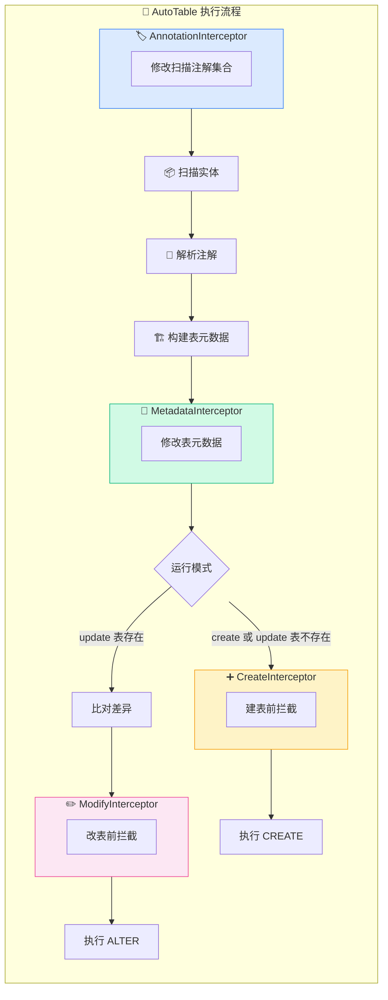
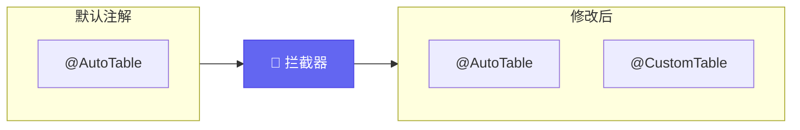
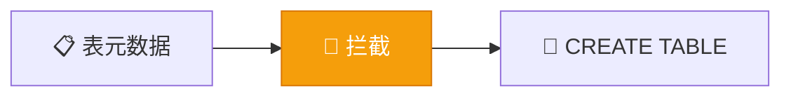
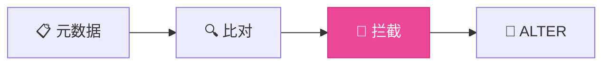
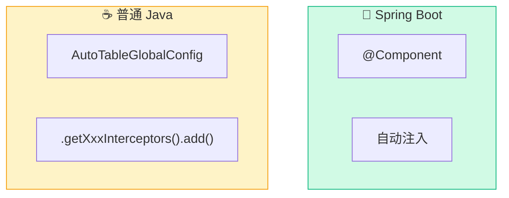

# 拦截器

AutoTable 执行过程中提供了多个钩子，方便拦截甚至修改过程中的信息。

## 拦截器全景



## 拦截器列表

| 拦截器 | 触发时机 | 用途 |
|--------|----------|------|
| `AutoTableAnnotationInterceptor` | 扫描实体前 | 修改要扫描的注解集合 |
| `BuildTableMetadataInterceptor` | 元数据构建后 | 修改表/字段信息 |
| `CreateTableInterceptor` | CREATE 执行前 | 建表前自定义处理 |
| `ModifyTableInterceptor` | ALTER 执行前 | 改表前自定义处理 |

## AutoTableAnnotationInterceptor

修改需要被扫描的注解集合，进而改变自动建表的实体集合。

**触发时机**：在扫描实体类之前



### 接口定义

```java
@FunctionalInterface
public interface AutoTableAnnotationInterceptor {
    /**
     * 包含和排斥取交集，即：如果既包含又排斥，则会排除
     */
    void intercept(Set<Class<? extends Annotation>> includeAnnotations, 
                   Set<Class<? extends Annotation>> excludeAnnotations);
}
```

### 使用示例

```java
@Component
public class MyAnnotationInterceptor implements AutoTableAnnotationInterceptor {
    
    @Override
    public void intercept(Set<Class<? extends Annotation>> include,
                          Set<Class<? extends Annotation>> exclude) {
        // 添加自定义注解到扫描列表
        include.add(MyCustomTable.class);
        // 排除某些注解
        exclude.add(IgnoreTable.class);
    }
}
```

## BuildTableMetadataInterceptor

拦截修改表信息，比如对表及字段的注释进行国际化。

**触发时机**：每个表元数据构建完成后，执行 SQL 之前


### 接口定义

```java
@FunctionalInterface
public interface BuildTableMetadataInterceptor {
    /**
     * @param databaseDialect 数据库方言：MySQL、PostgreSQL、SQLite 等
     * @param tableMetadata   表元数据
     */
    void intercept(final String databaseDialect, final TableMetadata tableMetadata);
}
```

### 使用示例

```java
@Component
public class I18nInterceptor implements BuildTableMetadataInterceptor {
    
    public void intercept(final String databaseDialect, final TableMetadata tableMetadata) {
        if (DatabaseDialect.MYSQL.equals(databaseDialect)) {
            MysqlTableMetadata meta = (MysqlTableMetadata) tableMetadata;
            // 修改表注释为国际化内容
            meta.setComment(i18n(meta.getComment()));
        }
    }
}
```

::: tip 注入方式
- **Spring Boot**：使用 `@Component` 注解自动注入
- **普通 Java**：`AutoTableGlobalConfig.instance().getBuildTableMetadataInterceptors().add(...)`
:::

## CreateTableInterceptor

在确定要执行建表前进行拦截，可以修改信息影响建表逻辑。

**触发时机**：CREATE TABLE SQL 执行之前



### 接口定义

```java
@FunctionalInterface
public interface CreateTableInterceptor {
    void beforeCreateTable(String databaseDialect, final TableMetadata tableMetadata);
}
```

### 使用示例

```java
@Component
public class MyCreateInterceptor implements CreateTableInterceptor {
    
    @Override
    public void beforeCreateTable(String dialect, TableMetadata metadata) {
        log.info("即将创建表: {}", metadata.getTableName());
    }
}
```

## ModifyTableInterceptor

在确定要执行改表前进行拦截，可以修改信息影响改表逻辑。

**触发时机**：表结构比对完成后，ALTER TABLE SQL 执行之前



### 接口定义

```java
@FunctionalInterface
public interface ModifyTableInterceptor {
    void beforeModifyTable(String databaseDialect, 
                           final TableMetadata tableMetadata, 
                           final CompareTableInfo compareTableInfo);
}
```

### 使用示例

```java
@Component
public class MyModifyInterceptor implements ModifyTableInterceptor {
    
    @Override
    public void beforeModifyTable(String dialect, 
                                   TableMetadata metadata,
                                   CompareTableInfo compareInfo) {
        // 可以查看 compareInfo 中的差异信息
        log.info("即将修改表: {}, 差异: {}", 
                 metadata.getTableName(), 
                 compareInfo.needModify());
    }
}
```

## 注册方式



### Spring Boot

```java
@Component
public class MyInterceptor implements BuildTableMetadataInterceptor {
    // 自动注入
}
```

### 普通 Java

```java
// 获取实例并添加拦截器
AutoTableGlobalConfig config = AutoTableGlobalConfig.instance();

config.getAutoTableAnnotationInterceptors().add(new MyAnnotationInterceptor());
config.getBuildTableMetadataInterceptors().add(new MyMetadataInterceptor());
config.getCreateTableInterceptors().add(new MyCreateInterceptor());
config.getModifyTableInterceptors().add(new MyModifyInterceptor());
```

## 下一步

- 了解 [事件回调](/高级功能/事件回调) 机制
- 查看 [工作原理](/核心概念/工作原理) 了解完整执行流程
