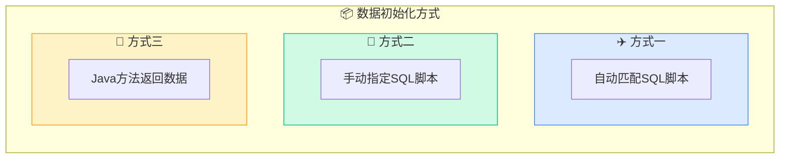
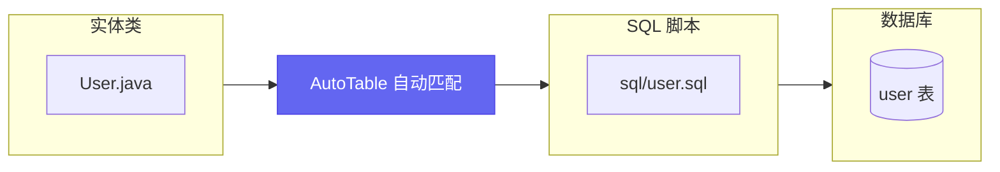
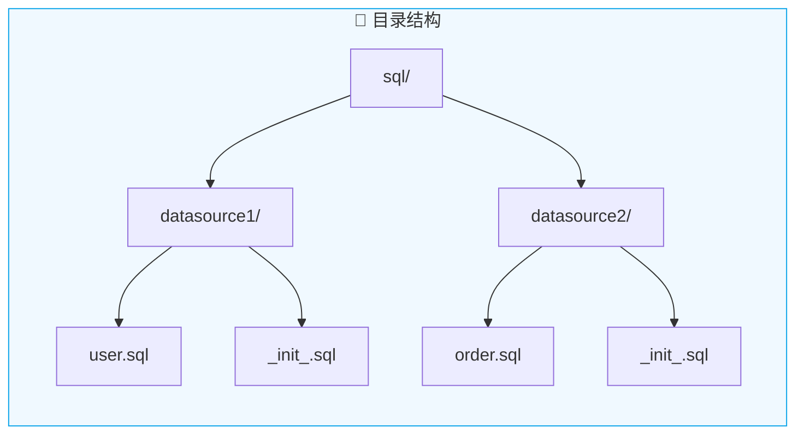
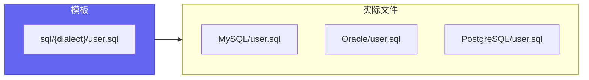
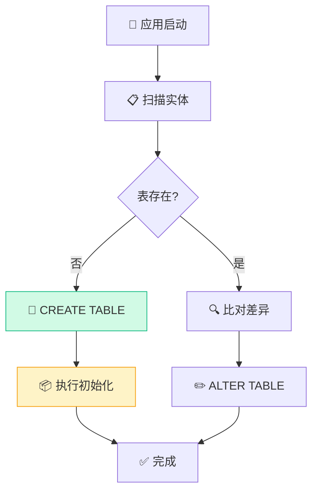

# 数据初始化

在自动创建完表格后，系统通常需要初始化数据，比如用户表、权限表等。

## 三种初始化方式



## 方式一：自动匹配 SQL 脚本



> 配置项：[auto-table.init-data](/API参考/配置项#init-data)

### 单数据源场景

系统默认读取 `classpath:sql` 目录下的脚本，只会在相关表创建完成时执行一次。

```
src/main/resources/
└── sql/
    ├── user.sql          # user 表初始化数据
    ├── role.sql          # role 表初始化数据
    └── _init_.sql        # 所有表创建完成后执行
```

::: tip 配置项
- `base-path`：修改脚本根目录，默认 `classpath:sql`
- `default-init-file-name`：修改全局初始化文件名，默认 `_init_`
:::

### 多数据源场景



```
src/main/resources/
└── sql/
    ├── datasource1/
    │   ├── user.sql           # datasource1 的 user 表
    │   └── _init_.sql         # datasource1 整库初始化
    └── datasource2/
        ├── order.sql          # datasource2 的 order 表
        └── _init_.sql         # datasource2 整库初始化
```

## 方式二：手动指定 SQL 脚本

通过 `@AutoTable` 的 `initSql` 属性指定 SQL 脚本位置。


```java
@AutoTable(
    comment = "自定义sql文件初始化数据", 
    initSql = "classpath:customize_path/InitData.sql"
)
public class InitDataCustomizeFile {
    private String name;
}
```

### 多库适配

`initSql` 支持 `{dialect}` 占位符，自动匹配当前数据库类型：

```java
@AutoTable(initSql = "classpath:sql/{dialect}/user.sql")
public class User {
    // ...
}
```



## 方式三：Java 方法返回数据

通过 `@InitDataList` 注解指定 Java 方法返回的数据集合。


```java
@Data
@NoArgsConstructor
@AllArgsConstructor
@AutoTable(comment = "用 Java 方法初始化数据")
public class InitDataJavaMethod {

    private String name;

    @InitDataList
    public static List<InitDataJavaMethod> getInitData() {
        return Arrays.asList(
            new InitDataJavaMethod("张三"),
            new InitDataJavaMethod("李四")
        );
    }

    @InitDataList
    private static List<InitDataJavaMethod> getMoreData() {
        return Arrays.asList(
            new InitDataJavaMethod("王五"),
            new InitDataJavaMethod("赵六")
        );
    }
}
```

::: warning 注意事项
1. 必须是**静态方法**
2. 需要 `@InitDataList` 注解标注
3. 返回值必须是 `List<Entity>`
4. 该方法只能在实体类中定义
:::

## 执行时机



**关键点**：
- 初始化数据只在**表创建时**执行一次
- 表已存在时，**不会**重复执行
- 通过监听 `CreateTableFinishCallback` 回调触发

## 下一步

- 了解 [事件回调](/高级功能/事件回调) 机制
- 查看 [配置项](/API参考/配置项) 完整说明
